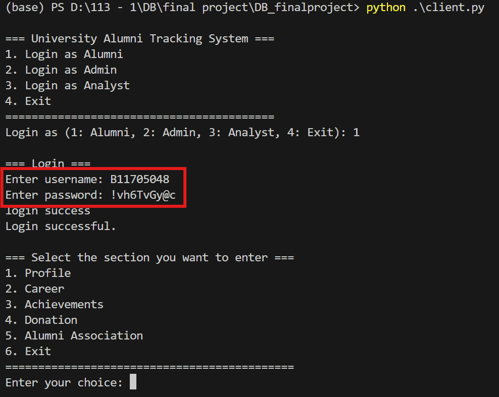

# University Alumni Tracking System


## Introduction

University Alumni Tracking System 是一個用於記錄與管理校友信息的系統，旨在促進學校與校友之間的聯繫。該系統支持多角色操作，包括 Alumni、Admin、校友會幹部及資料分析師，功能涵蓋校友資料維護、職業歷程更新、捐款管理、活動參與紀錄及數據分析。此系統幫助學校分析校友成就與支持情況，促進校友資源的整合與應用。

## Table of Contents
- [Authors](#Authors)
- [Installation](#installation)
- [Setting](#Setting)
- [Execute](#Execute)
- [Appendix](#Appendix:各角色擁有的權限)
## Authors

- 李訓佑 (B11705022)
- 林杰 (B11705048)
- 劉士銓 (B11705059)
## Installation

- Python 3.9.13
- PostgreSQL 16.4
- python library: `requests`, `psycopg2`, `datetime`, `flask`, `logging`, `os`
- 如果電腦缺少以上的套件，建議以下面的方式在terminal進行下載
```bash
  pip install <python library>
```
    
## Setting
- 使用備份檔 dbfinal 復原資料庫
- 預設連線通道為 127.0.0.1:5001，可至 server.py 及 client.py 修改
- 在 `db_connection.py` 內設定您的 database 密碼
- `server.py` 和 database 之間的連接 port 預設為5433，可至`db_connection.py`調整

## Execute
### Server
- 先執行 `server.py` 啟動伺服器
```
python .\server.py 
```

### Client
- 透過`client.py` 和伺服器連線
```
python .\client.py 
```
-  根據不同的身分有不同的帳號密碼以及使用介面：
    - 一般使用者：Alumni:
        - 帳號：B11705048
        - 密碼：!vh6TvGy@c
        
    - 業務經營者：Alumni with Alumni Association
        - 帳號：B11705022
        - 密碼：123
      
    - 網站經營者：Admin
        - 帳號：Admin
        - 密碼：admin
      


## Appendix: 各角色擁有的權限

### 一般使用者 (alumni)
* 更新 個人資料
* 查看 個人學位
* 查看 已報名參加校友會舉辦的活動
* 查看 參加的校友會
* 查看 所有校友會
* 查看 所有未來的活動
  
### 業務經營者 (alumni association)
* 新增 活動 (association event)
* 刪除 活動 (要可以cascade到刪除成員的活動參與紀錄)
* 查看 校友會成員
* 新增 校友會成員
* 刪除 校友會成員 (要可以cascade到刪除成員的活動參與紀錄)
* 新增 活動成員
* 刪除 活動成員
* 更新 幹部名單 (轉移權限)
  
### 網站管理者 (NTU alumni center)
* 新增 donation 紀錄
* 查看 donation 紀錄
* 更新 donation 紀錄
* 刪除 donation 紀錄
* 新增 帳號
* 更新 帳號
* 刪除 帳號
* 新增 achievement 紀錄
* 更新 achievement 紀錄
* 刪除 achievement 紀錄
